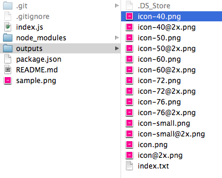
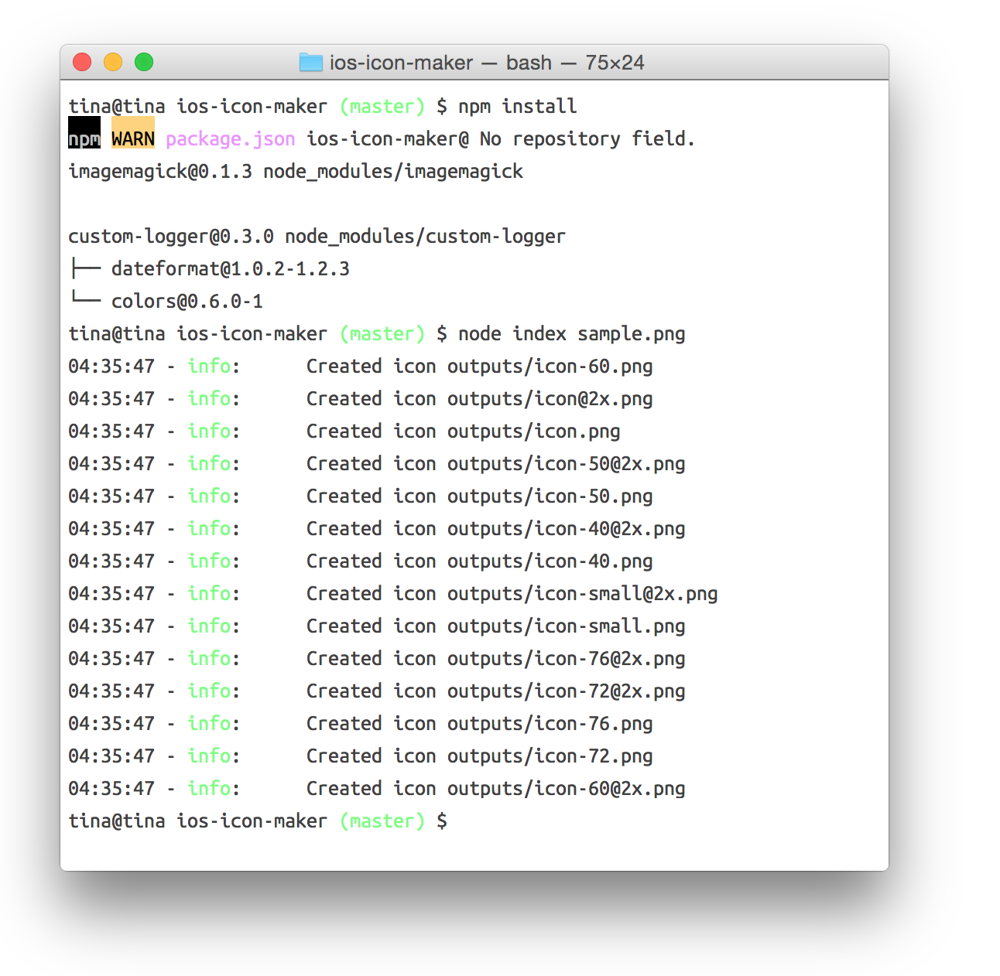

# Generate iOS device icons

## Dependencies

Install ImageMagick. On Mac, this can be done using Homebrew:

    brew install imagemagick

Install Node.js dependencies:

    npm install


## Usage

To process your image, run `index.js` in Node and pass the image path as the first argument:


```bash
node index sample.png
```

Icons will be generated in the `outputs/` directory.


### Output

#### Files



#### Console


